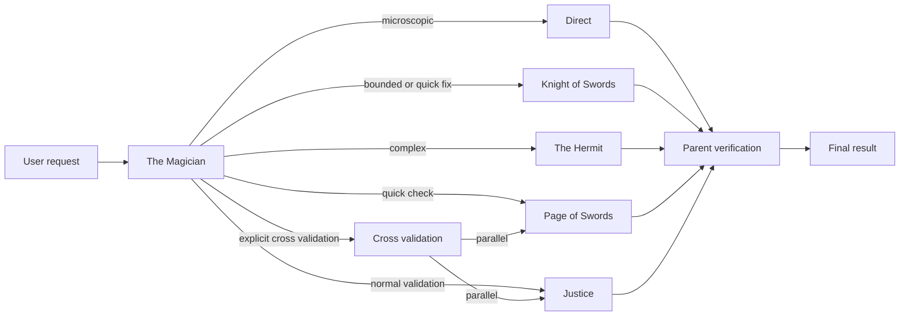
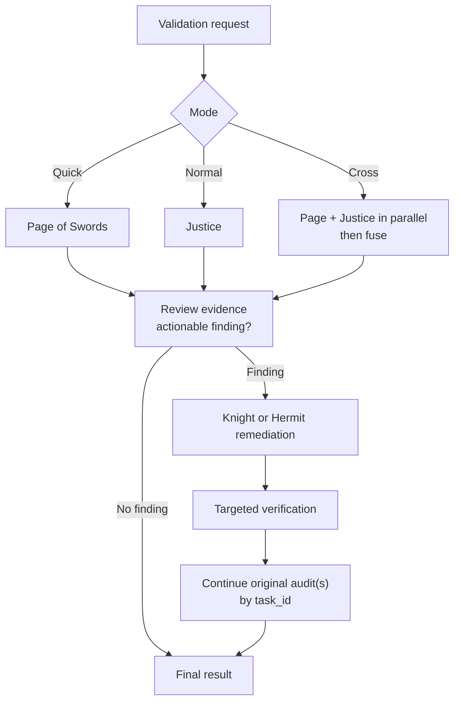

<p align="center">
  
</p>

<h1 align="center">OpenCode Arcana</h1>

<p align="center">
  <strong>Native-task orchestration for OpenCode</strong><br>
  Turn one engineering request into deliberate routing, focused execution, and evidence-based verification.
</p>

> **Status:** Source-installed from a local checkout; not published to npm · OpenCode `>=1.18.13 <1.19.0`

OpenCode Arcana is an OpenCode plugin with one visible `magician` primary agent and four hidden workers. It classifies intent, delegates through OpenCode's native `task` tool, coordinates implementation or audit work, and verifies the integrated result while preserving native child-session visibility.

## Agent Lineup

| Role | Agent | Default model | Boundary | Responsibility |
| --- | --- | --- | --- | --- |
| Primary | `magician` | `openai/gpt-5.6-sol` · `xhigh` | Can edit, run permitted checks, and delegate only to the four workers | The Magician analyzes intent, routes work, coordinates findings, and verifies the integrated result. |
| Fast worker | `knight-of-swords` | `opencode-go/deepseek-v4-flash` · `max` | Can edit and run approved checks; cannot call `task` | Atomic, low-ambiguity implementation in a small known scope. |
| Deep worker | `hermit` | `openai/gpt-5.6-luna` · `xhigh` | Can edit and run approved checks; cannot call `task` | Complex, ambiguous, multi-file, architectural, root-cause, security, concurrency, or data-sensitive work. |
| Fast auditor | `page-of-swords` | `opencode-go/deepseek-v4-flash` · `max` | Read-only; no shell; secret-bearing reads denied | Focused checks and quick validation. |
| Deep auditor | `justice` | `openai/gpt-5.6-luna` · `xhigh` | Read-only; no shell; secret-bearing reads denied | Thorough behavioral and architectural validation. |

The four workers are hidden subagents. The visible entrypoint is `magician`, selectable as the primary agent in OpenCode.

## Why Arcana

| Capability | What it provides |
| --- | --- |
| Intent-aware routing | Natural-language work is classified as Direct, Fast, Deep, or an audit workflow. |
| Native delegation | Implementation and audit work use OpenCode's built-in `task` tool. |
| Explicit validation | Quick checks, normal validation, and cross validation have deterministic entrypoints. |
| Evidence-led remediation | Audits begin read-only; validated findings are remediated and revalidated. |
| Native child sessions | Delegated work remains inspectable through OpenCode's session lifecycle and TUI. |

## How it works

The Magician keeps the decision point in the primary session, then sends a self-contained contract to the selected native child session. Direct work is reserved for genuinely microscopic changes; implementation and audit work use the worker lineup.



The primary agent can call exactly these four native subagents: `knight-of-swords`, `hermit`, `page-of-swords`, and `justice`. Workers cannot recursively delegate.

## Routing model

| Intent | Route | Worker | Parent behavior |
| --- | --- | --- | --- |
| Microscopic, obvious change | Direct | None | The Magician handles the change and checks the result. |
| Small bounded implementation or explicit quick fix | Fast | `knight-of-swords` | Inspect the diff and run a narrow check; an explicit quick fix uses shallow parent verification and no audit unless requested. |
| Complex, ambiguous, multi-file, architectural, security, concurrency, or data-sensitive work | Deep | `hermit` | Inspect the integrated result and run appropriate verification. |
| Explicit quick check | Fast Audit | `page-of-swords` | Remediate validated findings, then continue the same audit with its `task_id`. |
| Ordinary audit, review, validation, or verification | Deep Audit | `justice` | Remediate validated findings, then continue the same audit with its `task_id`. |
| Explicit cross validation | Fast Audit + Deep Audit | `page-of-swords` + `justice` | Run both independently, fuse evidence, remediate, then revalidate both original audit sessions. |

The words `audit`, `review`, `validate`, and `check` do not imply cross validation by themselves. Cross validation requires an explicit signal such as `cross validation`, `cross-validate`, `walidacja krzyzowa`, or `/cross-validate`.

## Commands

All commands target `magician` with `subtask: false`, so they preserve orchestration rather than bypassing it.

| Command | Behavior |
| --- | --- |
| `/quick-fix <request>` | Delegate implementation to Knight of Swords, inspect the resulting diff, and perform only a narrow sanity check. |
| `/quick-check <target>` | Run one Page of Swords audit, remediate validated findings, and revalidate the same audit session. |
| `/validate <target>` | Run one Justice audit, remediate validated findings, and revalidate the same audit session. |
| `/cross-validate <target>` | Run independent Page of Swords and Justice audits in the background, fuse evidence, remediate, and revalidate both original audit sessions. |

## Validation workflows

All audit modes start read-only. The Magician inspects the reports, rejects unsupported or duplicate concerns, delegates only validated remediation, checks the remediation diff, and continues the original audit session with its native `task_id`.



For cross validation, Arcana asks OpenCode to launch two independent native background tasks before processing either report. The required environment flag and native background-task support are documented in the installation section; Arcana does not enforce that prerequisite programmatically.

## Native task by design

OpenCode owns child permission derivation, task depth, continuation, cancellation, background jobs, result injection, and native TUI cards inside its built-in `task` tool. Arcana therefore uses that lifecycle instead of registering a parallel task tool, shadowing `task`, or wrapping child sessions in a custom dispatcher.

Every delegated operation has a native child session, and the same `task_id` remains available for audit revalidation. A provider or model failure is reported as a failure; Arcana does not retry through another model. A substantive Knight of Swords `BLOCKED` result can escalate to The Hermit because that is complexity routing, not model fallback.

## TUI navigation

The TUI plugin registers one command for native task children:

- `/subagents` opens a selectable list of child sessions for the current session.
- `/children` is an alias for `/subagents`.
- `Ctrl+Shift+S` opens the same child-session picker.

Open a session before invoking the picker. The dialog shows the card title, functional role, runtime ID, session title, and current status, then navigates to the selected native session.

## Safety boundaries

- Auditors are read-only. They can inspect permitted files with `read`, `glob`, and `grep`, but have no shell or edit access.
- Audit reads deny common secret-bearing paths and files, including environment files, SSH and cloud credentials, private keys, certificates, package-manager credentials, and sensitive local configuration. `.env.example` remains readable.
- Implementation workers cannot call `task`, so delegation cannot recurse.
- Arcana's task permission allows only the four active worker names; other subagent targets are denied.
- Destructive shell patterns such as hard reset, forced clean, recursive removal, and recursive forced PowerShell removal are denied.
- Model fallback is not automatic. Availability failures are surfaced instead of silently switching providers or workers.

## Installation and configuration

### Prerequisites

- Git
- Bun
- OpenCode `>=1.18.13 <1.19.0`

### Clone and check

```sh
git clone <repository-url> arcana
cd arcana
bun install
bun run check
```

Arcana is source-installed from this checkout and is not published to npm.

### OpenCode server configuration

Load the server plugin exactly once in the global `opencode.json`. Preserve unrelated settings when merging this tuple:

```json
{
  "plugin": [
    [
      "file:///absolute/path/to/arcana",
      {
        "models": {
          "magician": {
            "model": "openai/gpt-5.6-sol",
            "variant": "xhigh"
          },
          "knight-of-swords": {
            "model": "opencode-go/deepseek-v4-flash",
            "variant": "max"
          },
          "hermit": {
            "model": "openai/gpt-5.6-luna",
            "variant": "xhigh"
          }
        }
      }
    ]
  ],
  "default_agent": "magician"
}
```

The `file:///` URL points to the checkout. Keep that location stable so the server and TUI entrypoints continue to resolve. For example:

- POSIX: `file:///home/you/path/to/arcana`
- Windows: `file:///C:/path/to/arcana`

### TUI configuration

Load the TUI entry exactly once in the global `tui.json`:

```json
{
  "plugin": [
    "file:///absolute/path/to/arcana"
  ]
}
```

### Cross-validation environment

Set the flag in the current shell when using cross validation:

```sh
export OPENCODE_EXPERIMENTAL_BACKGROUND_SUBAGENTS=true
```

```powershell
$env:OPENCODE_EXPERIMENTAL_BACKGROUND_SUBAGENTS = "true"
```

These commands affect the current shell. Persist the setting through a shell profile or user environment configuration when appropriate. OpenCode consumes this flag; Arcana documents the prerequisite but does not programmatically enforce it. Restart OpenCode after changing plugin configuration or environment variables.

### Model overrides

The plugin accepts only a `models` option. Each role may override `model` and `variant`; omitted roles retain their defaults. Model IDs must use the `provider/model` format.

| Option | Applies to | Default |
| --- | --- | --- |
| `models.magician` | The Magician primary agent | `openai/gpt-5.6-sol` · `xhigh` |
| `models["knight-of-swords"]` | Knight of Swords and Page of Swords | `opencode-go/deepseek-v4-flash` · `max` |
| `models.hermit` | The Hermit and Justice | `openai/gpt-5.6-luna` · `xhigh` |

Page of Swords inherits the Knight of Swords selection, and Justice inherits The Hermit's selection. Unknown option keys and invalid model selections are rejected rather than silently ignored.

## Verification

The public reproducible baseline is:

```sh
bun run check
```

This currently runs TypeScript checking plus **22 tests and 74 assertions**. After installation, `opencode debug config` can be used to inspect the resolved OpenCode configuration:

```sh
opencode debug config
```

## Project structure

```text
src/
  server.ts              Server plugin entrypoint
  tui.ts                 Native child-session navigation
  options.ts             Model defaults and option validation
  configure-agents.ts    Agent and permission configuration
  configure-commands.ts  Explicit command registration
  prompts.ts             Prompt loading
prompts/
  magician.md            Routing and orchestration contract
  knight-of-swords.md    Fast implementation contract
  hermit.md              Deep implementation contract
  page-of-swords.md      Focused read-only audit contract
  justice.md             Thorough read-only audit contract
test/                     Unit and contract tests
docs/
  img/arcana-overview.png
  adr/0001-native-task-first.md
  adr/0002-intent-and-explicit-commands.md
package.json
```

## Current constraints and limitations

- Arcana supports the OpenCode `1.18.x` range stated above.
- There is no automatic model fallback. Provider failure is reported; only a substantive Knight of Swords complexity block can escalate to The Hermit.
- Cross validation depends on OpenCode native background-task support and `OPENCODE_EXPERIMENTAL_BACKGROUND_SUBAGENTS=true`; the prerequisite is prompt/documentation-driven rather than programmatically enforced by Arcana.
- Interactive TUI behavior after a full restart remains manually unverified, although the TUI entrypoint and child-session navigation are implemented.

## License

OpenCode Arcana is available under the [MIT License](LICENSE).
