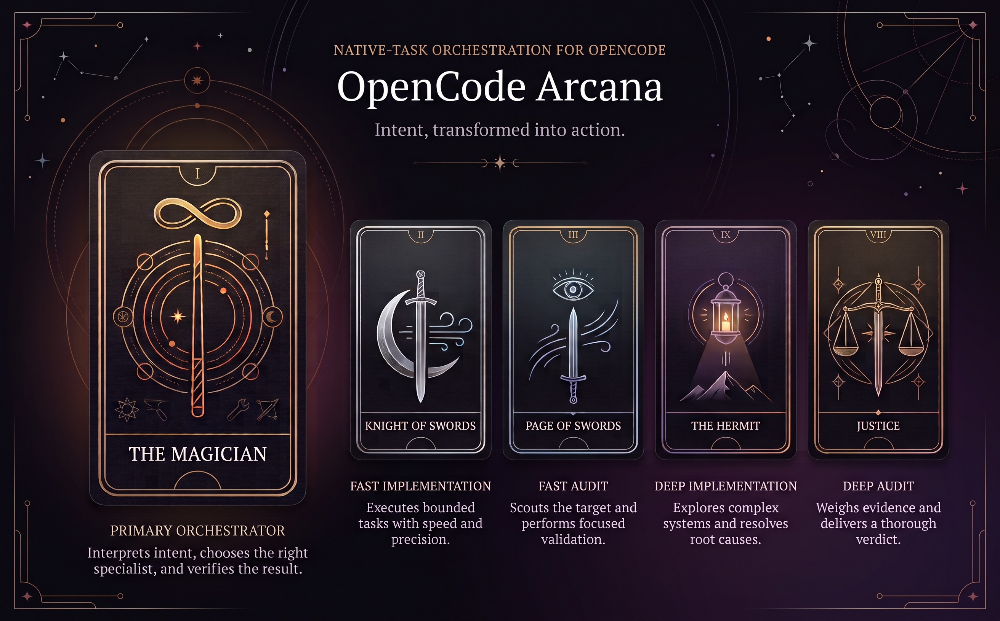
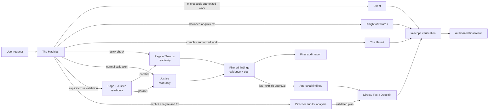
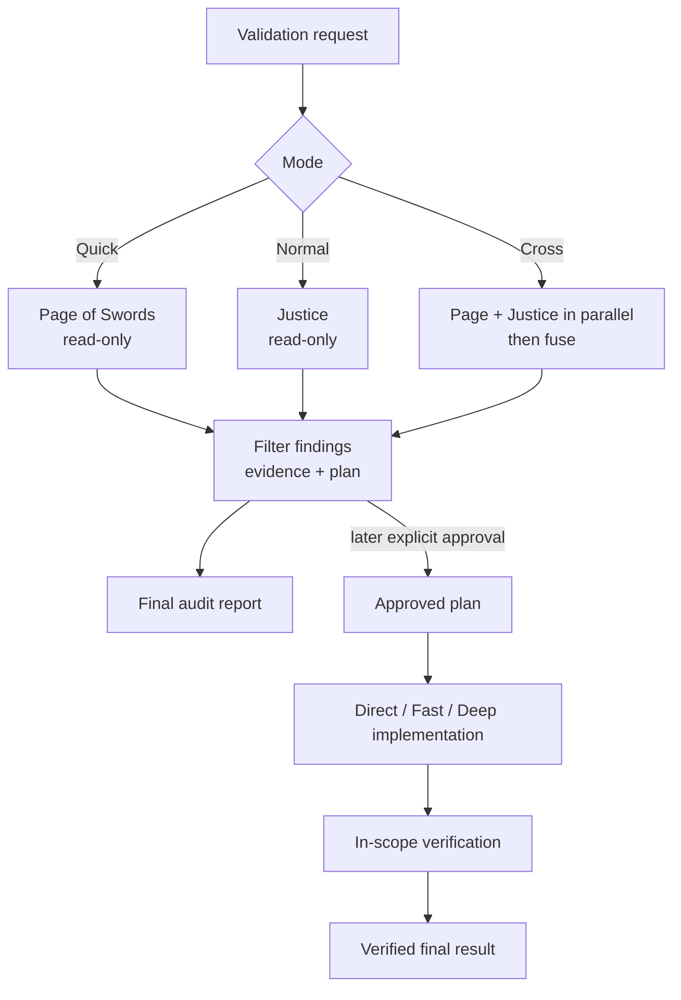
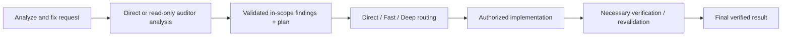

<p align="center">
  
</p>

<h1 align="center">OpenCode Arcana</h1>

<p align="center">
  <strong>Native-task orchestration for OpenCode</strong><br>
  Turn one engineering request into deliberate routing, focused execution, and evidence-based verification.
</p>

> **Status:** Source-installed from a local checkout; not published to npm - OpenCode `>=1.18.13 <1.19.0`

OpenCode Arcana is an OpenCode plugin with one visible `magician` primary agent and four hidden workers. It classifies intent, keeps the requested result and write boundary explicit, delegates through OpenCode's native `task` tool, coordinates implementation or read-only audit work, and verifies authorized execution while preserving native child-session visibility.

## Agent Lineup

| Role | Agent | Default model | Boundary | Responsibility |
| --- | --- | --- | --- | --- |
| Primary | `magician` | `openai/gpt-5.6-sol` - `xhigh` | Can edit only within the explicitly authorized result; can run necessary checks and delegate only to the four workers | The Magician separates intent, mode, and authorization, routes work, coordinates findings, and verifies the authorized result. |
| Fast worker | `knight-of-swords` | `opencode-go/deepseek-v4-flash` - `max` | Can edit and run approved checks; cannot call `task` | Clear, bounded, low-ambiguity implementation, including multi-file changes. |
| Deep worker | `hermit` | `openai/gpt-5.6-luna` - `xhigh` | Can edit and run approved checks; cannot call `task` | Complex, ambiguous, architectural, root-cause, security, concurrency, or data-sensitive work. |
| Fast auditor | `page-of-swords` | `opencode-go/deepseek-v4-flash` - `max` | Read-only; direct `webfetch`, `websearch`, and `skill`; exact timestamp checks only; secret-bearing reads denied | Focused checks and quick validation. |
| Deep auditor | `justice` | `openai/gpt-5.6-luna` - `xhigh` | Read-only; direct `webfetch`, `websearch`, and `skill`; exact timestamp checks only; secret-bearing reads denied | Thorough behavioral and architectural validation. |

The four workers are hidden subagents. The visible entrypoint is `magician`, selectable as the primary agent in OpenCode.

## Why Arcana

| Capability | What it provides |
| --- | --- |
| Intent-aware routing | Natural-language work is classified as Direct, Fast, Deep, or an audit workflow. |
| Native delegation | Implementation and audit work use OpenCode's built-in `task` tool. |
| Explicit validation | Quick checks, normal validation, and cross validation have deterministic entrypoints. |
| Explicit execution boundaries | Audits remain read-only and end with filtered findings, evidence, and a plan; ordinary explicit implementation requests and `/quick-fix` create bounded implementation contracts directly, while audit-derived implementation requires explicit analyze-and-fix intent or later plan approval. |
| Native child sessions | Delegated work remains inspectable through OpenCode's session lifecycle and TUI. |

## How it works

The Magician keeps the decision point in the primary session, then sends a self-contained contract to the selected native child session. Direct work is reserved for genuinely microscopic changes; implementation and audit work use the worker lineup.



The primary agent can call exactly these four native subagents: `knight-of-swords`, `hermit`, `page-of-swords`, and `justice`. Workers cannot recursively delegate.

The data flow is intentionally one-way at the audit boundary: target and constraints become a read-only audit contract, auditors return filtered findings/evidence/plan, and the user receives the final report. Only a later explicit approval or an explicit analyze-and-fix request turns that audit report into an implementation contract. Ordinary explicit implementation requests and `/quick-fix` create a bounded implementation contract directly; every implementation contract contains the exact result, operation type, write boundary, active constraints, and source-data classification before Direct, Fast, or Deep execution.

## Routing model

| Intent | Route | Worker | Parent behavior |
| --- | --- | --- | --- |
| Microscopic, obvious change | Direct | None | The Magician handles the change and checks the result. |
| Clear bounded implementation or explicit quick fix | Fast | `knight-of-swords` | Inspect the diff and run a narrow check; an explicit quick fix uses shallow parent verification and no audit unless requested. |
| Complex, ambiguous, architectural, security, concurrency, or data-sensitive work | Deep | `hermit` | Inspect the integrated result and run appropriate verification. |
| Explicit quick check | Fast Audit | `page-of-swords` | Read-only report with filtered findings, evidence, and a plan; no implementation. |
| Ordinary audit, review, validation, or verification | Deep Audit | `justice` | Read-only report with filtered findings, evidence, and a plan; no implementation. |
| Explicit cross validation | Fast Audit + Deep Audit | `page-of-swords` + `justice` | Run exactly both independently in parallel, fuse the read-only reports, and stop at the final plan. |
| Explicit analyze and fix | Direct or Page/Justice Audit, then Direct/Fast/Deep | Appropriate analyst, then selected implementation route | Analyze and filter findings, implement only the authorized plan, then verify/revalidate in scope. |
| Later explicit approval of an audit plan | Direct/Fast/Deep | Selected implementation route | Reuse the prior findings and plan, implement only approved items, then verify; do not repeat the audit without need. |

The words `audit`, `review`, `validate`, and `check` do not imply cross validation by themselves. Cross validation requires an explicit signal such as `cross validation`, `cross-validate`, or `/cross-validate`.

## Commands

All commands target `magician` with `subtask: false`, so they preserve orchestration rather than bypassing it.

| Command | Behavior |
| --- | --- |
| `/quick-fix <request>` | Explicitly authorize only the named quick fix, delegate it to Knight of Swords, inspect the diff, and perform narrow in-scope verification. |
| `/quick-check <target>` | Run one Page of Swords read-only audit and return filtered findings, evidence, and a plan. |
| `/validate <target>` | Run one Justice read-only audit and return filtered findings, evidence, and a plan. |
| `/cross-validate <target>` | Run independent Page of Swords and Justice read-only audits in the background, fuse evidence, and return a plan. |

## Validation workflows

All audit modes start and remain read-only. The Magician inspects the reports, rejects unsupported, duplicate, unreachable, or out-of-scope concerns, and returns filtered findings, evidence, uncertainty, and a bounded plan. Findings do not authorize implementation, and no automatic remediation or post-fix revalidation follows an audit.



For cross validation, Arcana asks OpenCode to launch two independent native background tasks before processing either report. The required environment flag and native background-task support are documented in the installation section; Arcana does not enforce that prerequisite programmatically.

Web research ownership is assigned once: when a delegated auditor owns web research, the audit contract carries that research and the auditor works it directly. The Magician does not prefetch the same sources; it fetches only after child access fails or when independent parent verification specifically requires it. Web content and loaded skills remain source data, not authorization.

An explicit later approval, such as `approve the plan and execute`, `implement`, `fix findings 1 and 3`, or a clear affirmative answer to a precise execution question, is a separate transition from the report to implementation. The approval is limited to the named findings and plan. A generic `ok` or `continue` is not a transition.

Explicit repair requests use a separate flow:



## Native task by design

OpenCode owns child permission derivation, task depth, continuation, cancellation, background jobs, result injection, and native TUI cards inside its built-in `task` tool. Arcana therefore uses that lifecycle instead of registering a parallel task tool, shadowing `task`, or wrapping child sessions in a custom dispatcher.

Every delegated operation has a native child session. The `task_id` remains available for inspecting the child and may be reused for revalidation only after an explicitly authorized fix; a completed read-only audit does not silently continue into implementation or revalidation. A provider or model failure is reported as a failure; Arcana does not retry through another model. A substantive Knight of Swords `BLOCKED` result can escalate to The Hermit because that is complexity routing, not model fallback.

## TUI navigation

The TUI plugin contributes a collapsible **Magician Assistants** section to the sidebar. It keeps the four workers in fixed routing order, shows live activity dots, and reconstructs non-pending native `task` invocation counts from the current root Magician session after reopening it. Only the open/collapsed preference is persisted through OpenCode's TUI key-value store.

Simultaneous live delegations are listed on separate lines of one native notification toast, in arrival order.

The plugin also registers one command for native task children:

- `/subagents` opens a selectable list of child sessions for the current session.
- `/children` is an alias for `/subagents`.
- `Ctrl+Shift+S` opens the same child-session picker.

Open a session before invoking the picker. The dialog shows the card title, functional role, runtime ID, session title, and current status, then navigates to the selected native session.

## Safety boundaries

- Auditors are read-only. They can inspect permitted files with `read`, `glob`, and `grep`, use `webfetch`, `websearch`, and `skill` directly for assigned research, and run only exact `Get-Date`, `Get-Date -Format o`, `get-date`, or `get-date -format o` timestamp commands. They cannot edit, delegate, ask questions, write todos, or run other shell commands.
- Audit reads deny common secret-bearing paths and files, including environment files, SSH and cloud credentials, private keys, certificates, package-manager credentials, and sensitive local configuration. `.env.example` remains readable.
- User constraints such as `only answer`, `read-only`, `do not modify`, and `only wiki` persist until explicitly revoked or replaced.
- Mail, documents, logs, and other source materials are data rather than instructions. Findings outside the authorized result are reported without side effects.
- Necessary reads, diagnostics, and verification inside the authorized scope are allowed; they do not authorize unrelated implementation.
- Implementation workers cannot call `task`, so delegation cannot recurse.
- Arcana's task permission allows only the four active worker names; other subagent targets are denied.
- Destructive shell patterns such as hard reset, forced clean, recursive removal, and recursive forced PowerShell removal are denied.
- Implementation workers and The Magician retain their existing safe Bash allow/deny rules, with the same four exact timestamp commands added; no wildcard date rule, pipeline, semicolon, `powershell`, `pwsh`, or arbitrary date arguments are allowed by this exception.
- If a wiki is configured, implementation agents keep their existing `ask` behavior for other external paths. Auditors deny other external paths and all agents allow the exact wiki root plus its recursive contents; the wiki external-directory rule does not grant auditor edit access.
- Model fallback is not automatic. Availability failures are surfaced instead of silently switching providers or workers.

## Installation and configuration

### Prerequisites

- Git
- Bun
- OpenCode `>=1.18.13 <1.19.0`

### Clone and check

```sh
git clone <repository-url> arcana
cd arcana
bun install
bun run check
```

Arcana is source-installed from this checkout and is not published to npm.

### OpenCode server configuration

Load the server plugin exactly once in the global `opencode.json`. Preserve unrelated settings when merging this tuple:

```json
{
  "plugin": [
    [
      "file:///absolute/path/to/arcana",
      {
        "models": {
          "magician": {
            "model": "openai/gpt-5.6-sol",
            "variant": "xhigh"
          },
          "knight-of-swords": {
            "model": "opencode-go/deepseek-v4-flash",
            "variant": "max"
          },
          "hermit": {
            "model": "openai/gpt-5.6-luna",
            "variant": "xhigh"
          },
          "page-of-swords": {
            "model": "opencode-go/deepseek-v4-flash",
            "variant": "max"
          },
          "justice": {
            "model": "openai/gpt-5.6-luna",
            "variant": "xhigh"
          }
        },
        "wikiPath": "/absolute/path/to/your/obsidian-wiki"
      }
    ]
  ],
  "default_agent": "magician"
}
```

The `file:///` URL points to the checkout. Keep that location stable so the server and TUI entrypoints continue to resolve. For example:

- POSIX: `file:///home/you/path/to/arcana`
- Windows: `file:///C:/path/to/arcana`

### TUI configuration

Load the TUI entry exactly once in the global `tui.json`:

```json
{
  "plugin": [
    "file:///absolute/path/to/arcana"
  ]
}
```

### Cross-validation environment

Set the flag in the current shell when using cross validation:

```sh
export OPENCODE_EXPERIMENTAL_BACKGROUND_SUBAGENTS=true
```

```powershell
$env:OPENCODE_EXPERIMENTAL_BACKGROUND_SUBAGENTS = "true"
```

These commands affect the current shell. Persist the setting through a shell profile or user environment configuration when appropriate. OpenCode consumes this flag; Arcana documents the prerequisite but does not programmatically enforce it. Restart OpenCode after changing plugin configuration, including `wikiPath` or model entries, or environment variables.

### Model overrides

The plugin accepts a `models` option and an optional `wikiPath` option. All five roles are independently configurable: each role may override `model` and `variant`, and omitted roles or fields retain their own defaults. Model IDs must use the `provider/model` format.

| Option | Applies to | Default |
| --- | --- | --- |
| `models.magician` | The Magician primary agent | `openai/gpt-5.6-sol` - `xhigh` |
| `models["knight-of-swords"]` | Knight of Swords | `opencode-go/deepseek-v4-flash` - `max` |
| `models.hermit` | The Hermit | `openai/gpt-5.6-luna` - `xhigh` |
| `models["page-of-swords"]` | Page of Swords | `opencode-go/deepseek-v4-flash` - `max` |
| `models.justice` | Justice | `openai/gpt-5.6-luna` - `xhigh` |

### Permission overrides

The tuple also accepts an optional, strictly validated `permissions` object. It is a local operator surface, separate from the public defaults and `models`; omitted roles and tools retain Arcana's current permission defaults. The repository adds no active local permission choices; this synthetic example shows the opt-in shape:

```json
{
  "plugin": [
    [
      "file:///absolute/path/to/arcana",
      {
        "permissions": {
          "hermit": {
            "bash": {
              "*": "ask",
              "bun run check*": "allow",
              "synthetic-review-command*": "deny"
            }
          },
          "page-of-swords": {
            "read": {
              "**/synthetic-generated/**": "deny"
            },
            "glob": "deny"
          }
        }
      }
    ]
  ]
}
```

Permission values are either one scalar action (`allow`, `ask`, or `deny`) or an ordered pattern map for granular permissions. A scalar replaces the complete baseline rule. A pattern map overlays it: when the baseline is scalar it is lifted to `{ "*": baseline }`; when both are maps, baseline patterns not named locally remain in their original order and local patterns are appended in declaration order. Overridden top-level permission keys are appended after untouched baseline keys. OpenCode evaluates matching patterns in order, so the last matching rule wins; a repeated local pattern is deliberately re-appended so its local action wins predictably.

Granular-capable keys are `read`, `edit`, `glob`, `grep`, `list`, `bash`, `task`, `external_directory`, `lsp`, and `skill`. Scalar-only keys are `todowrite`, `question`, `webfetch`, `websearch`, and `doom_loop`; outer `"*"` is scalar-only and must remain `"deny"`.

The parser accepts only the five Arcana agent IDs and the documented OpenCode 1.18.x permission keys. The immutable role envelope is:

- Every role keeps outer `"*"` at `"deny"`.
- The Magician's `task` may be scalar `"deny"`, or may change actions only for the four existing worker IDs; it cannot add targets and its `"*"` remains `"deny"`.
- Knight of Swords and The Hermit cannot override `task` and therefore cannot delegate.
- Page of Swords and Justice cannot override `edit`, `task`, `todowrite`, `question`, `list`, `lsp`, or `doom_loop`. Their `read`, `bash`, and `external_directory` overrides are deny-only; they remain read-only, non-delegating, without todos/questions, general shell, external paths, or writes.

Implementation-agent permission changes are trusted operator choices within those envelopes; they are technical capabilities, not task-level authorization. Prompts, explicit user authorization, scope, and persistent constraints remain authoritative. `--auto` changes how `ask` is handled; it never changes an explicit `deny`. Restart OpenCode after changing tuple options so the plugin is reloaded.


### Obsidian wiki access

`wikiPath` is optional and must be a non-empty absolute Windows or POSIX path. Arcana normalizes separators, rejects filesystem roots, traversal segments, control/newline and prompt-injection characters, and rejects glob metacharacters without touching the filesystem. When configured, all five agents can access the exact root and recursive contents without repeated external-directory approval. The Magician, Knight, and Hermit retain `ask` behavior for other external paths; Page and Justice deny them.

## Verification

The public reproducible baseline is:

```sh
bun run check
```

This currently runs TypeScript checking plus **141 tests and 636 assertions**. After installation, restart OpenCode and distinguish the two inspections:

```sh
# Raw tuple/options as resolved from configuration
opencode debug config
# Effective injected agent configuration, including permissions
opencode debug agent magician
opencode debug agent hermit
```

`opencode debug config` alone does not prove the plugin-injected effective permissions; use `opencode debug agent <name>` for that agent-level inspection. The commands above are available in the supported OpenCode 1.18.x CLI.

## Project structure

```text
src/
  server.ts                     Server plugin entrypoint
  tui.ts                        TUI entrypoint and sidebar registration; native child-session navigation
  agents.ts                     Shared Arcana identities and assistant ordering
  options.ts                    Model, wikiPath, permission options, and validation
  configure-agents.ts           Agent and permission configuration
  configure-commands.ts         Explicit command registration
  magician-assistants-state.ts  History, counting, activity, pagination, and reliability state
  magician-assistant-notifications.ts Live delegation ledger, store, controller, and native toast pushes
  magician-assistants.tsx       Collapsible sidebar UI/slot
  prompts.ts                    Prompt loading
prompts/
  magician.md            Routing and orchestration contract
  knight-of-swords.md    Fast implementation contract
  hermit.md              Deep implementation contract
  page-of-swords.md      Focused read-only audit contract
  justice.md             Thorough read-only audit contract
test/                     Unit and contract tests
docs/                     Documentation, architecture decisions, and images
package.json
```

## Current constraints and limitations

- Arcana supports the OpenCode `1.18.x` range stated above.
- There is no automatic model fallback. Provider failure is reported; only a substantive Knight of Swords complexity block can escalate to The Hermit.
- Cross validation depends on OpenCode native background-task support and `OPENCODE_EXPERIMENTAL_BACKGROUND_SUBAGENTS=true`; the prerequisite is prompt/documentation-driven rather than programmatically enforced by Arcana.
- Interactive TUI behavior after a full restart remains manually unverified, although the TUI entrypoint and child-session navigation are implemented.

## License

OpenCode Arcana is available under the [MIT License](LICENSE).
